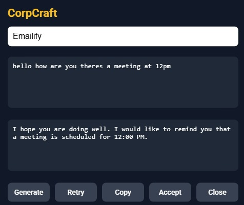
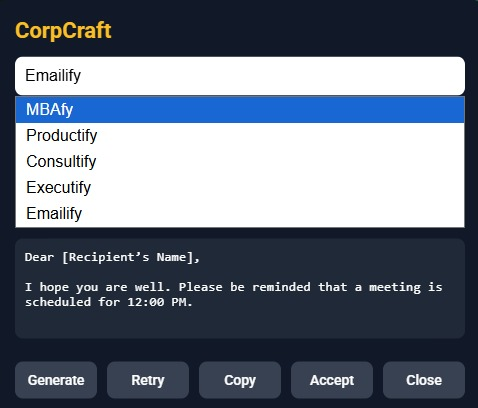

# CorpCraft

AI-Powered Professional Communication Assistant

## Overview

CorpCraft is a Chrome Extension that transforms informal, broken, or casual text into polished professional communication directly within web applications such as Gmail and WhatsApp Web.

Users can select text, invoke CorpCraft using the floating action button or keyboard shortcuts, choose a communication mode, and instantly generate business-ready content without leaving their workflow.

---

## Features

### Communication Modes

* MBAfy – Business Analyst style communication
* Productify – Product Management communication
* Consultify – Consulting-style communication
* Executify – Executive-level communication
* Emailify – Professional email drafting

### Productivity Features

* Floating "Craft" action button
* Keyboard shortcuts (Ctrl + Shift + K, Alt + C)
* Draggable AI panel
* Generate and Retry responses
* One-click Copy
* Accept and replace text
* Cross-site support for Gmail and WhatsApp Web

---

## Tech Stack

### Frontend

* JavaScript
* HTML
* CSS
* Chrome Extension Manifest V3

### Backend

* Supabase Edge Functions
* Deno Runtime

### AI Layer

* OpenRouter API
* GPT-OSS-120B

---

## Architecture

User Selection → Chrome Extension → Supabase Edge Function → OpenRouter → LLM Processing → Generated Professional Output

---

## Installation

1. Clone the repository
2. Configure Supabase credentials
3. Deploy the Edge Function
4. Open Chrome Extensions
5. Enable Developer Mode
6. Click "Load Unpacked"
7. Select the `extension` folder

---

## Screenshots

### Main Panel

### Communication Modes

### Gmail Integration

### WhatsApp Integration

### Floating Action Button

---

## Future Enhancements

* Improved cross-site compatibility
* Additional communication modes
* Chrome Web Store deployment
* Custom user-defined writing styles

---

## Author

Jainam Gada

B.Tech Information Technology | AI & Product Development Enthusiast
